# PRD & Implementation Plan - SILKA Keuangan / Back Office

> Dokumen eksekusi untuk AI coding agent. Letakkan file ini di root project, sejajar dengan `composer.json`, lalu minta AI membaca seluruh dokumen sebelum mengubah source code.

## 0. Instruksi Wajib untuk AI Coding Agent

### 0.1 Misi

Implementasikan aplikasi SILKA Keuangan/Back Office sesuai dokumen ini ke dalam repository yang sedang dibuka. Jangan berhenti pada pembuatan contoh kode, mockup, atau planning baru. Terapkan perubahan langsung ke project secara bertahap, verifikasi setiap tahap, dan laporkan hasil akhirnya.

### 0.2 Urutan kerja wajib

1. Baca seluruh `PRD-SILKA.md` sampai selesai.
2. Audit project sebelum menulis kode, minimal mencakup:
   - `composer.json` dan `composer.lock`;
   - `README.md`;
   - `.env.example`; jika konfigurasi lokal di `.env` diperlukan untuk menjalankan project, gunakan tanpa mencetak, menyalin, atau memasukkannya ke commit;
   - routes, middleware, controllers, requests, models, services, views, migrations, seeders, dan tests;
   - struktur database atau file `silka.sql` jika tersedia;
   - implementasi autentikasi dan arti kolom `users.level` yang sudah ada.
3. Bandingkan kondisi repository dengan requirement pada dokumen ini.
4. Buat ringkasan gap secara singkat di `IMPLEMENTATION_LOG.md`, lalu mulai implementasi dari fase pertama yang belum selesai.
5. Kerjakan satu fase secara utuh, jalankan verifikasi yang relevan, baru lanjut ke fase berikutnya.
6. Perbarui checklist pada Bagian 19 dan `IMPLEMENTATION_LOG.md` setelah setiap fase.
7. Setelah seluruh scope selesai, jalankan test suite, audit keamanan dasar, serta smoke test alur utama.
8. Berikan laporan akhir berisi file yang diubah, migration yang dibuat, test yang dijalankan, hasil test, asumsi yang digunakan, dan blocker yang masih tersisa.

### 0.3 Aturan keselamatan

- Jangan menjalankan `migrate:fresh`, `db:wipe`, `DROP DATABASE`, `DROP TABLE`, `TRUNCATE`, atau perintah destruktif lain pada database yang belum dipastikan sebagai database development/test kosong.
- Jangan menghapus atau menimpa perubahan user yang tidak berkaitan dengan fitur ini.
- Jangan mengganti Laravel 8, PHP 7.4, database engine, atau arsitektur utama tanpa persetujuan eksplisit.
- Jangan mengubah schema langsung melalui GUI/manual SQL jika perubahan dapat dibuat sebagai migration Laravel yang aman dan dapat ditinjau.
- Jangan mengarang nilai `users.level`, klasifikasi COA untuk piutang/hutang, atau struktur kolom yang tidak ditemukan. Ikuti protokol pada Bagian 16.
- Jangan menaruh kredensial, password, token, isi `.env`, atau data pribadi di source code, log, test fixture publik, maupun laporan implementasi.
- Semua operasi yang mengubah transaksi dan saldo COA harus atomik menggunakan database transaction dan row locking.
- Gunakan database khusus testing saat menjalankan test yang menghapus atau me-reset data.

### 0.4 Prinsip pengambilan keputusan

- `DECIDED`: keputusan di PRD ini wajib diikuti.
- `ASSUMPTION`: boleh digunakan agar pekerjaan tidak berhenti, tetapi harus dicatat di laporan akhir.
- `NEEDS_CONFIRMATION`: jangan ditebak. Implementasikan bagian yang tidak bergantung padanya, lalu tandai fitur terkait sebagai blocker yang spesifik.
- Jika kode existing sudah memiliki perilaku yang berbeda, jangan langsung menimpanya. Dokumentasikan konflik, utamakan integritas data, lalu pilih perubahan paling kecil yang memenuhi requirement.

---

## 1. Metadata Produk

| Atribut | Nilai |
|---|---|
| Nama produk | SILKA Keuangan / Back Office |
| Jenis aplikasi | Web internal, standalone |
| Status dokumen | Implementation-ready PRD v1.0 |
| Framework | Laravel 8.x |
| Runtime | PHP 7.4.x |
| Database | MySQL/MariaDB, nama database `silka` |
| Render UI | Server-rendered Blade, mengikuti stack dan design system existing |
| Autentikasi | Session-based authentication milik aplikasi sendiri |
| Integrasi Core System | Tidak ada; aplikasi berdiri dan di-deploy terpisah |
| Bahasa antarmuka | Bahasa Indonesia |
| Mata uang default | Rupiah/IDR |

## 2. Ringkasan Produk

SILKA adalah aplikasi internal untuk mengelola pemasukan dan pengeluaran, Chart of Accounts (COA), saldo tiap akun, kategori transaksi, target capaian tahunan, laporan, serta akun user. Aplikasi harus memiliki autentikasi, database, konfigurasi, dan deployment sendiri serta tidak menjadi modul dari Core System.

Nilai utama produk adalah keakuratan saldo. Setiap create, edit, atau delete transaksi harus menghasilkan perubahan saldo COA yang konsisten, atomik, dapat diuji, dan tidak meninggalkan data setengah tersimpan.

## 3. Sasaran dan Indikator Keberhasilan

### 3.1 Sasaran

1. Memusatkan pencatatan pemasukan dan pengeluaran.
2. Menjaga saldo COA tetap konsisten dengan riwayat transaksi.
3. Menyediakan ringkasan keuangan berdasarkan tahun.
4. Menyediakan master kategori dan COA yang mudah dikelola.
5. Menyediakan laporan yang dapat dilihat, dicetak, dan diekspor ke Excel.
6. Mengelola target capaian tahunan.
7. Mengelola user internal beserta foto profil secara aman.

### 3.2 Indikator keberhasilan fungsional

- Tidak ada perubahan saldo tanpa transaksi yang sah.
- Tidak ada transaksi yang menunjuk kategori atau COA yang tidak valid.
- Create, edit, dan delete transaksi menghasilkan saldo yang tepat, termasuk ketika jenis, nominal, atau COA berubah.
- Kegagalan di tengah operasi keuangan menyebabkan rollback penuh.
- Guest tidak dapat mengakses halaman internal.
- Laporan web, print, dan Excel memakai filter serta dataset yang sama.
- Database deployment tidak tercampur data lama akibat tindakan otomatis yang destruktif.

## 4. Scope

### 4.1 In scope

- Login dan logout user internal.
- Proteksi seluruh route internal dengan authentication middleware.
- Dashboard berdasarkan parameter tahun.
- CRUD transaksi pemasukan/pengeluaran.
- Penyesuaian saldo COA saat transaksi dibuat, diedit, atau dihapus.
- CRUD kategori dan pemindahan transaksi ketika kategori dihapus.
- CRUD COA, penggunaan master cluster COA, pencarian, serta saldo awal.
- Laporan berdasarkan kategori dan rentang tanggal.
- Tampilan web, print view, dan export `.xlsx`.
- CRUD user dan foto profil maksimal 2 MB.
- CRUD target capaian tahunan.
- Migration/schema compatibility, validation, authorization, testing, serta dokumentasi deployment.

### 4.2 Out of scope

- Integrasi dengan Core System.
- Public registration.
- Aplikasi mobile native.
- Public REST API.
- Multi-company atau multi-tenant.
- Integrasi bank, payment gateway, atau rekonsiliasi bank otomatis.
- Workflow approval berjenjang.
- Import transaksi massal.
- Perubahan langsung/manual terhadap saldo setelah COA dipakai transaksi.
- Fitur audit trail lanjutan di luar kolom timestamp dan logging standar.
- Upgrade major framework/runtime sebagai bagian implementasi ini.

## 5. Pengguna dan Hak Akses

### 5.1 Jenis pengguna

1. **User internal/staf**
   - Login ke aplikasi.
   - Mengakses modul yang diizinkan oleh level existing.
   - Minimal dapat menggunakan dashboard, transaksi, laporan, kategori, COA, dan target jika kebijakan existing mengizinkan.

2. **Administrator**
   - Memiliki akses internal.
   - Dapat mengelola user.
   - Tidak boleh menghapus akun sendiri jika tindakan tersebut membuatnya kehilangan akses.
   - Administrator terakhir tidak boleh dihapus.

### 5.2 Keputusan akses

- `DECIDED`: semua route selain login wajib memakai middleware `auth`.
- `DECIDED`: modul user wajib memiliki pemeriksaan authorization tambahan, bukan hanya menyembunyikan menu.
- `NEEDS_CONFIRMATION ROLE-01`: arti dan nilai valid dari `users.level` harus diambil dari schema, seed data, atau implementasi existing. AI tidak boleh menebak apakah admin bernilai `1`, `admin`, atau nilai lainnya.
- Bila mapping level belum dapat ditemukan, modul selain manajemen user tetap dapat dikerjakan. Akses manajemen user harus default-deny sampai mapping dikonfirmasi.

## 6. Alur Utama Aplikasi

1. User membuka aplikasi.
2. Sistem memeriksa session autentikasi.
3. Guest diarahkan ke halaman login.
4. Login yang valid meregenerasi session dan mengarahkan user ke dashboard.
5. User yang sudah login dapat membuka menu sesuai hak akses:
   - Dashboard;
   - Transaksi;
   - Kategori;
   - Laporan;
   - COA;
   - User;
   - Target Capaian.
6. Logout menghapus session aplikasi, meregenerasi CSRF token, lalu kembali ke login.

### 6.1 Flowchart Fungsional Lengkap

Diagram ini menjadi referensi visual alur bisnis. Requirement rinci, aturan integritas saldo, authorization, serta guardrail database pada bagian lain di dokumen ini tetap berlaku ketika diagram menyederhanakan detail implementasi.

```mermaid
flowchart TD
    %% --- 1. OTENTIKASI & RELEVANSI DASBOR ---
    Start(["User Membuka App"]) --> AuthCheck{"Apakah User Sudah Auth?"}
    AuthCheck -- Tidak --> LoginPage["Halaman Login"]
    LoginPage -- Login Berhasil --> MenuSelect
    AuthCheck -- Ya --> MenuSelect{"User Memilih Menu"}

    %% --- 2. DASBOR UTAMA ---
    MenuSelect -- Dashboard / Home --> ReqTahun{"Parameter Tahun Ada?"}
    ReqTahun -- Ya --> SetTahun["Gunakan Tahun Input"]
    ReqTahun -- Tidak --> SetDefaultTahun["Default: Tahun Ini"]
    SetTahun --> CalcPiutang["Hitung Piutang & Hutang Tahun Lalu"]
    SetDefaultTahun --> CalcPiutang
    CalcPiutang --> CalcIncomeExpense["Agregasi Pemasukan & Pengeluaran - Hari Ini, Bulan Ini, Tahun Ini"]
    CalcIncomeExpense --> GetTarget["Ambil Target Capaian Tahunan"]
    GetTarget --> RenderDash["Render Halaman Dashboard/Index"]

    %% --- 3. MANAJEMEN TRANSAKSI & INTEGRASI SALDO COA ---
    MenuSelect -- Transaksi --> TransAction{"Pilih Aksi Transaksi"}
    TransAction -- Lihat/Paging --> ViewTrans["Tampilkan List Transaksi - Pagination 20 Item"]
    TransAction -- Cari Data --> SearchTransFilter["Filter Tanggal & Keterangan"] --> ViewTransSearch["Tampilkan Hasil Pencarian"]

    %% Alur Input Transaksi + Update Saldo COA
    TransAction -- Tambah --> InputTrans["Input: Tanggal, Nominal, Kategori, Akun COA, Keterangan, Jenis"]
    InputTrans --> SaveTrans["Simpan Data Transaksi Baru"]
    SaveTrans --> FindCoa["Cari Akun COA Terkait by coa_id"]
    FindCoa --> CheckJenis{"Jenis Transaksi?"}
    CheckJenis -- Pemasukan --> AddSaldo["Update Saldo COA: Saldo = Saldo + Nominal"]
    CheckJenis -- Pengeluaran --> SubSaldo["Update Saldo COA: Saldo = Saldo - Nominal"]
    AddSaldo --> CommitTrans["Commit Transaction / Save COA"]
    SubSaldo --> CommitTrans
    CommitTrans --> ViewTrans

    TransAction -- Edit --> UpdateTrans["Update Transaksi by ID & Adjustment Saldo COA"] --> ViewTrans
    TransAction -- Hapus --> DeleteTrans["Hapus Transaksi & Revert Saldo COA"] --> ViewTrans

    %% --- 4. MANAJEMEN KATEGORI ---
    MenuSelect -- Kategori --> KatAction{"Pilih Aksi Kategori"}
    KatAction -- Lihat --> ViewKat["Tampilkan List Kategori"]
    KatAction -- Tambah --> SaveKat["Simpan Kategori Baru"] --> ViewKat
    KatAction -- Edit --> UpdateKat["Update Kategori by ID"] --> ViewKat
    KatAction -- Hapus --> DelKatCheck["Hapus Kategori by ID"] --> SafetyKat["Safety Check: Ubah Kategori Transaksi Terdampak ke ID default 1"] --> ViewKat

    %% --- 5. MANAJEMEN LAPORAN ---
    MenuSelect -- Laporan --> LapFilter{"Filter Kategori & Rentang Tanggal?"}
    LapFilter -- Belum Filter --> ViewLapEmpty["Tampilkan Form Laporan Kosong"]
    LapFilter -- Sudah Filter --> FetchLapData["Ambil Data Transaksi Sesuai Filter"]
    FetchLapData --> LapOutput{"Format Output"}
    LapOutput -- Web View --> ViewLap["Tampilkan Halaman Laporan"]
    LapOutput -- Print --> PrintLap["Halaman View Khusus Print"]
    LapOutput -- Excel --> ExportExcel["Download Laporan.xlsx"]

    %% --- 6. MANAJEMEN COA (CHART OF ACCOUNTS) ---
    MenuSelect -- COA --> CoaAction{"Pilih Aksi COA"}
    CoaAction -- Lihat --> ViewCoa["Tampilkan Seluruh COA + Saldo Saat Ini"]
    CoaAction -- Tambah --> CalcCluster["Hitung Cluster & Set Saldo Awal"] --> SaveCoa["Simpan COA Baru"] --> ViewCoa
    CoaAction -- Edit --> UpdateCoa["Update Kode & Nama COA"] --> ViewCoa
    CoaAction -- Hapus --> DeleteCoa["Hapus COA by ID"] --> ViewCoa
    CoaAction -- Cari --> FilterCoa["Filter Range Cluster & Search Key"] --> ViewCoaSearch["Tampilkan Search COA"]

    %% --- 7. MANAJEMEN USER ---
    MenuSelect -- User --> UserAction{"Pilih Aksi User"}
    UserAction -- Lihat --> ViewUser["Tampilkan List User"]
    UserAction -- Tambah --> ValidUserNew["Validasi Input & Foto Max 2MB"] --> UploadFotoNew["Upload & Rename Foto"] --> SaveUserNew["Save User + Hash Password"] --> ViewUser
    UserAction -- Edit --> ValidUserEdit["Validasi Data"] --> CheckFotoExist{"Foto Diubah?"}
    CheckFotoExist -- Ya --> DelOldFoto["Hapus Foto Lama & Upload Baru"] --> UpdateUserData["Update Data User"] --> ViewUser
    CheckFotoExist -- Tidak --> UpdateUserData
    UserAction -- Hapus --> DelUserFoto["Hapus File Foto User"] --> DelUser["Hapus Data User"] --> ViewUser

    %% --- 8. MANAJEMEN TARGET CAPAIAN ---
    MenuSelect -- Target Capaian --> TargetAction{"Pilih Aksi Target"}
    TargetAction -- Lihat --> ViewTarget["Tampilkan Target Tahunan"]
    TargetAction -- Tambah --> SaveTarget["Simpan Target Baru"] --> ViewTarget
    TargetAction -- Edit --> UpdateTarget["Update Tahun & Nominal Target"] --> ViewTarget
    TargetAction -- Hapus --> DeleteTarget["Hapus Target Tahunan"] --> ViewTarget

    %% --- STYLING DEFINITIONS ---
    classDef startEnd fill:#f9f,stroke:#333,stroke-width:2px;
    classDef process fill:#e1f5fe,stroke:#0288d1,stroke-width:1px;
    classDef decision fill:#fff9c4,stroke:#fbc02d,stroke-width:1px;
    classDef page fill:#f3e5f5,stroke:#7b1fa2,stroke-width:1px;

    %% --- APPLY CLASSES ---
    class Start startEnd;
    class AuthCheck,MenuSelect,ReqTahun,TransAction,CheckJenis,KatAction,LapFilter,LapOutput,CoaAction,UserAction,CheckFotoExist,TargetAction decision;
    class SetTahun,SetDefaultTahun,CalcPiutang,CalcIncomeExpense,GetTarget,SearchTransFilter,InputTrans,SaveTrans,FindCoa,AddSaldo,SubSaldo,CommitTrans,UpdateTrans,DeleteTrans,SaveKat,UpdateKat,DelKatCheck,SafetyKat,FetchLapData,CalcCluster,SaveCoa,UpdateCoa,DeleteCoa,FilterCoa,ValidUserNew,UploadFotoNew,SaveUserNew,ValidUserEdit,DelOldFoto,UpdateUserData,DelUserFoto,DelUser,SaveTarget,UpdateTarget,DeleteTarget process;
    class LoginPage,RenderDash,ViewTrans,ViewTransSearch,ViewKat,ViewLapEmpty,ViewLap,PrintLap,ExportExcel,ViewCoa,ViewCoaSearch,ViewUser,ViewTarget page;
```



## 7. Requirement Fungsional

### 7.1 Autentikasi

#### AUTH-001 - Login

- Form terdiri dari email dan password.
- Email wajib berformat valid.
- Kredensial diverifikasi melalui mekanisme auth Laravel.
- Password dibandingkan dengan hash, tidak pernah dengan plain text.
- Login berhasil harus meregenerasi session untuk mencegah session fixation.
- Login gagal menampilkan pesan generik dan tidak mengungkap apakah email terdaftar.
- Terapkan throttling/rate limit pada percobaan login.

#### AUTH-002 - Proteksi route

- Guest yang membuka route internal diarahkan ke login.
- User yang sudah login dan membuka login diarahkan ke dashboard.
- Pemeriksaan hak akses dilakukan di server melalui middleware, Gate, atau Policy.

#### AUTH-003 - Logout

- Hanya menerima request non-GET yang dilindungi CSRF.
- Session di-invalidate dan token CSRF diregenerasi.

#### AUTH-004 - Registrasi dan reset password

- Public registration tidak dibuat.
- Password reset bukan scope wajib kecuali implementasi existing sudah memilikinya dan harus dipertahankan.

### 7.2 Dashboard

#### DASH-001 - Pemilihan tahun

- Dashboard menerima query parameter `year`.
- Jika `year` valid, gunakan tahun tersebut sebagai tahun terpilih.
- Jika parameter kosong/tidak valid, gunakan tahun berjalan.
- Sediakan pemilih tahun pada UI dan pertahankan pilihan setelah submit.

#### DASH-002 - Ringkasan transaksi

Tampilkan minimal:

- total pemasukan hari ini;
- total pengeluaran hari ini;
- total pemasukan bulan berjalan;
- total pengeluaran bulan berjalan;
- total pemasukan pada tahun terpilih;
- total pengeluaran pada tahun terpilih;
- target capaian untuk tahun terpilih jika tersedia.

`DECIDED`: kartu "hari ini" dan "bulan ini" selalu mengacu ke tanggal kalender sekarang. Ringkasan tahunan dan target mengikuti `year` yang dipilih.

#### DASH-003 - Piutang dan hutang tahun sebelumnya

- Tahun acuan adalah `year - 1`.
- Nilai dihitung dari COA sesuai klasifikasi yang berlaku pada project/database.
- `NEEDS_CONFIRMATION COA-CLASS-01`: mapping `coa.jenis` atau `cluster` untuk akun piutang dan hutang belum didefinisikan dalam requirement sumber. AI wajib mengaudit data/schema existing dan tidak boleh membuat mapping finansial sendiri.
- Jika mapping belum ditemukan, tampilkan status fitur belum terkonfigurasi pada lingkungan development; jangan menampilkan angka palsu sebagai angka final.

#### DASH-004 - Empty state dan error handling

- Tahun tanpa transaksi tetap menampilkan nilai nol dengan format mata uang yang benar.
- Target yang belum dibuat ditampilkan sebagai "Belum ditentukan".
- Query agregasi tidak boleh menghasilkan error ketika tabel kosong.

### 7.3 Transaksi

#### TRX-001 - Daftar transaksi

- Tampilkan 20 record per halaman.
- Urutan default: `tanggal` terbaru, lalu `id` terbaru.
- Tampilkan tanggal, jenis, kategori, COA, nominal, keterangan, dan aksi.
- Pagination mempertahankan seluruh parameter filter.
- Sediakan empty state ketika belum ada data.

#### TRX-002 - Pencarian dan filter

- Search teks pada `keterangan`.
- Filter tanggal mendukung tanggal awal dan tanggal akhir.
- Filter opsional berdasarkan jenis, kategori, dan COA boleh ditambahkan karena menggunakan field yang sudah ada.
- Tanggal akhir tidak boleh lebih kecil dari tanggal awal.
- Query harus menggunakan Eloquent/query builder binding, bukan string SQL yang dirangkai dari input.

#### TRX-003 - Tambah transaksi

Field minimum:

| Field | Aturan |
|---|---|
| `tanggal` | Wajib, tanggal valid |
| `jenis` | Wajib, hanya `pemasukan` atau `pengeluaran` |
| `kategori_id` | Wajib, harus menunjuk kategori valid |
| `coa_id` | Wajib, harus menunjuk COA valid |
| `nominal` | Wajib, decimal lebih besar dari 0, jangan gunakan float |
| `keterangan` | Wajib, string, maksimal 1000 karakter |

Setelah validasi, sistem menyimpan transaksi dan mengubah saldo COA dalam satu database transaction.

#### TRX-004 - Efek saldo

Gunakan fungsi efek berikut:

```text
effect(pemasukan, nominal)   = +nominal
effect(pengeluaran, nominal) = -nominal
```

Create:

```text
saldo_baru = saldo_lama + effect(transaksi_baru)
```

Edit pada COA yang sama:

```text
saldo_baru = saldo_sekarang - effect(transaksi_lama) + effect(transaksi_baru)
```

Edit ketika COA berubah:

```text
saldo_COA_lama = saldo_COA_lama - effect(transaksi_lama)
saldo_COA_baru = saldo_COA_baru + effect(transaksi_baru)
```

Delete:

```text
saldo_baru = saldo_sekarang - effect(transaksi_yang_dihapus)
```

#### TRX-005 - Integritas dan concurrency

- Create, edit, dan delete wajib menggunakan `DB::transaction()`.
- Record transaksi yang diedit/dihapus serta record COA yang terdampak wajib dikunci dengan `lockForUpdate()`.
- Jika dua COA terdampak, kunci dalam urutan ID yang konsisten untuk mengurangi risiko deadlock.
- Jika COA tidak ditemukan, jangan simpan transaksi.
- Jika update saldo gagal, rollback seluruh operasi.
- Jangan mengandalkan JavaScript/UI untuk menjaga saldo; aturan harus ada di backend.
- Side effect saldo harus berada di service yang dapat diuji, bukan tersebar di controller/view.
- `ASSUMPTION TRX-NEG-01`: saldo negatif diperbolehkan karena requirement sumber tidak menentukan aturan insufficient balance. Catat asumsi ini di laporan akhir.

#### TRX-006 - Edit transaksi

- Seluruh field transaksi boleh diperbarui sesuai validasi create.
- Sistem harus membaca keadaan lama dari database, bukan dari hidden field browser.
- Revert efek lama terlebih dahulu, lalu terapkan efek baru secara atomik.
- Perubahan jenis, nominal, dan COA harus tercakup dalam test.

#### TRX-007 - Hapus transaksi

- Gunakan request `DELETE` dengan CSRF.
- Revert saldo sebelum record transaksi dihapus, dalam database transaction yang sama.
- Tampilkan konfirmasi pada UI.
- Kegagalan revert harus membatalkan penghapusan.

### 7.4 Kategori

#### CAT-001 - CRUD kategori

- List, tambah, edit, dan hapus berdasarkan ID.
- Nama kategori wajib diisi dan maksimal 150 karakter.
- Hindari kategori duplikat sesuai collation database.

#### CAT-002 - Kategori default

- Requirement sumber menetapkan kategori default dengan ID `1`.
- `ASSUMPTION CAT-DEFAULT-01`: jika data awal belum tersedia, kategori ID 1 dibuat dengan nama `Tanpa Kategori` melalui seeder/idempotent deployment step.
- Kategori default ID 1 tidak boleh dihapus.
- Jangan mengandalkan ID 1 tanpa melakukan pemeriksaan keberadaan record.

#### CAT-003 - Hapus kategori yang digunakan

- Hapus kategori dan pemindahan transaksi harus berada dalam satu database transaction.
- Semua transaksi yang memakai kategori tersebut dipindahkan ke kategori default ID 1.
- Setelah relasi dipindah, kategori lama boleh dihapus.
- Jika kategori default tidak tersedia, operasi dibatalkan dan menampilkan error yang dapat ditindaklanjuti.

### 7.5 Chart of Accounts (COA)

#### COA-001 - Daftar dan pencarian

- Tampilkan kode COA, nama COA, jenis, cluster, dan saldo saat ini.
- Pencarian teks minimal mencakup `kode_coa` dan `nama_coa`.
- Filter berdasarkan cluster.
- Pertahankan filter saat berpindah halaman.

#### COA-002 - Tambah COA

- Field minimum: kode COA, nama COA, jenis, cluster, dan saldo awal.
- Kode COA wajib unik.
- Cluster harus valid.
- Saldo awal menggunakan decimal, bukan float.
- Perhitungan/penentuan cluster harus mengikuti data dan pola existing; jangan mengarang formula cluster baru jika belum tersedia.

#### COA-003 - Edit COA

- Hanya kode, nama, jenis, dan cluster yang boleh diedit melalui CRUD biasa.
- Saldo tidak boleh diedit langsung setelah COA memiliki transaksi.
- Perubahan saldo harus berasal dari transaksi. Fitur koreksi/reconciliation terpisah berada di luar scope.

#### COA-004 - Hapus COA

- `DECIDED`: COA yang masih direferensikan transaksi tidak boleh dihapus.
- `DECIDED`: COA dengan saldo tidak sama dengan nol tidak boleh dihapus.
- Jika aman, COA dapat dihapus melalui request `DELETE` yang dilindungi CSRF.
- Foreign key harus menggunakan perilaku `RESTRICT`/setara, bukan cascade delete transaksi.

### 7.6 Laporan

#### RPT-001 - Form laporan

- Form dapat dibuka tanpa filter dan tidak wajib langsung memuat seluruh data.
- Filter minimum: kategori, tanggal awal, tanggal akhir.
- Tanggal akhir harus sama dengan atau setelah tanggal awal.
- Setelah submit, tampilkan filter aktif dan hasilnya.

#### RPT-002 - Dataset laporan

Kolom minimum:

- nomor;
- tanggal;
- jenis;
- kategori;
- kode dan nama COA;
- keterangan;
- nominal.

Tampilkan total pemasukan, total pengeluaran, dan selisih bersih untuk dataset yang sama.

#### RPT-003 - Web view

- Hasil mengikuti filter.
- Nominal ditampilkan dalam format IDR.
- Dataset besar tidak boleh dimuat tanpa batas pada tampilan web; gunakan pagination atau batas yang wajar.

#### RPT-004 - Print view

- Gunakan view khusus print tanpa navigasi dan tombol interaktif.
- Judul mencantumkan periode dan kategori aktif.
- Layout harus tetap terbaca pada kertas A4.

#### RPT-005 - Export Excel

- Menghasilkan file `.xlsx`, bukan file HTML/CSV yang hanya diganti ekstensi.
- Dataset dan filter harus identik dengan laporan web/print.
- Nama file deskriptif, misalnya `laporan-transaksi-2026-08-18.xlsx`.
- Lindungi field teks dari formula injection Excel. Nilai yang diawali `=`, `+`, `-`, atau `@` tidak boleh dieksekusi sebagai formula ketika berasal dari input user.
- Gunakan package existing atau package yang kompatibel dengan Laravel 8/PHP 7.4; jangan melakukan upgrade major hanya untuk export.

### 7.7 User

#### USR-001 - Daftar user

- Tampilkan nama, email, level, foto, dan aksi.
- Modul dilindungi authorization administrator.
- Jangan tampilkan password/hash.

#### USR-002 - Tambah user

| Field | Aturan |
|---|---|
| `name` | Wajib, string, maksimal 255 karakter |
| `email` | Wajib, email valid dan unik |
| `password` | Wajib, minimal mengikuti kebijakan password existing; simpan dengan `Hash` Laravel |
| `level` | Wajib, hanya nilai level yang diizinkan oleh mapping existing |
| `foto` | Opsional, image valid, maksimal 2 MB |

- File foto hanya menerima tipe yang diizinkan, minimal JPEG, PNG, atau WebP.
- Nama file dibuat ulang menggunakan identifier acak; jangan memakai nama asli sebagai nama penyimpanan final.
- Simpan melalui filesystem disk yang dikonfigurasi, bukan path hard-coded.

#### USR-003 - Edit user

- Email tetap unik dengan mengecualikan user yang sedang diedit.
- Password kosong berarti password lama dipertahankan.
- Password baru wajib di-hash.
- Jika foto diganti, simpan foto baru dengan aman dan hapus foto lama setelah perubahan berhasil.
- Jika database update gagal, file baru yang tidak terpakai harus dibersihkan.

#### USR-004 - Hapus user

- User tidak boleh menghapus akun yang sedang dipakai untuk login.
- Administrator terakhir tidak boleh dihapus.
- Hapus file foto yang dikelola aplikasi setelah penghapusan record berhasil.
- Jangan pernah menghapus file default/shared asset.

### 7.8 Target Capaian

#### TGT-001 - CRUD target

- List, tambah, edit, dan hapus target tahunan.
- Field: `tahun` dan `target_capaian`.
- Tahun wajib berupa tahun empat digit pada rentang yang wajar.
- Nominal wajib decimal dan tidak boleh negatif.
- Hanya satu target untuk satu tahun; enforce melalui validation dan unique index jika aman terhadap data existing.
- Dashboard mengambil target berdasarkan tahun terpilih.

## 8. Data Model dan Schema

### 8.1 Tabel existing yang diharapkan

| Tabel | Kolom utama dari dokumen sumber | Fungsi |
|---|---|---|
| `cluster` | `id_cluster`, `nama` | Master cluster COA |
| `coa` | `id`, `kode_coa`, `nama_coa`, `jenis`, `cluster`, timestamps | Master akun COA |
| `kategori` | `id`, `kategori`, timestamps | Master kategori transaksi |
| `transaksi` | `id`, `tanggal`, `jenis`, `kategori_id`, `nominal`, `keterangan`, timestamps | Pemasukan/pengeluaran |
| `target_capaians` | `id`, `tahun`, `target_capaian`, timestamps | Target tahunan |
| `users` | `id`, `name`, `email`, `email_verified_at`, `password`, `level`, `foto`, `remember_token`, timestamps | User aplikasi |
| `failed_jobs` | standar Laravel | Failed jobs |
| `migrations` | standar Laravel | Riwayat migration |
| `password_resets` | standar Laravel 8 | Password reset existing |

### 8.2 Gap schema yang harus diaudit

1. Dokumen sumber membutuhkan `transaksi.coa_id`, tetapi kolom tersebut tidak terlihat pada daftar schema existing.
2. Dokumen sumber membutuhkan saldo per COA, tetapi kolom saldo tidak terlihat pada daftar kolom tabel `coa`.
3. Tipe data primary key `coa.id`, `kategori.id`, dan tabel lain belum diketahui secara pasti.
4. Arti nilai `users.level` belum diketahui.
5. Mapping `coa.jenis`/cluster untuk piutang dan hutang belum diketahui.

### 8.3 Target schema minimum

Setelah audit, schema efektif harus memiliki kemampuan berikut:

- `transaksi.coa_id` dengan tipe yang kompatibel terhadap primary key COA, index, dan foreign key `RESTRICT`.
- `coa.saldo` menggunakan `DECIMAL(18,2)` atau precision existing yang setara, default `0`.
- `transaksi.nominal` menggunakan decimal, bukan float/double.
- Index pada `transaksi.tanggal`, `transaksi.kategori_id`, dan `transaksi.coa_id`.
- Unique index pada `coa.kode_coa` jika data existing bersih.
- Unique index pada `target_capaians.tahun` jika tidak terdapat duplikasi existing.
- Foreign key kategori yang tidak menyebabkan kategori default ikut terhapus.

### 8.4 Strategi migration kompatibel

1. Periksa schema aktual, jangan hanya mengandalkan tabel pada PRD.
2. Buat migration kondisional yang tidak mencoba menambah kolom/index yang sudah ada.
3. Samakan tipe foreign key dengan tipe primary key existing.
4. Jika ada data existing, tambahkan kolom relasi secara nullable terlebih dahulu.
5. Backfill hanya dengan rule yang dapat dibuktikan dari data existing.
6. Jangan menetapkan COA acak untuk transaksi lama.
7. Jadikan kolom wajib/non-null hanya setelah seluruh data valid.
8. Tambahkan constraint setelah orphan dan duplikasi diselesaikan.
9. Semua tindakan pembersihan data harus berupa langkah deployment eksplisit, bukan side effect tersembunyi di migration.

### 8.5 Relasi minimum

```text
cluster.id_cluster  1 ---- n  coa.cluster
coa.id              1 ---- n  transaksi.coa_id
kategori.id         1 ---- n  transaksi.kategori_id
target_capaians.tahun        dipakai oleh dashboard
```

`transaksi.created_by`/`user_id` bersifat opsional dan tidak ditambahkan pada MVP kecuali sudah ada atau disetujui.

## 9. Aturan Data dan Keuangan

### 9.1 Nilai uang

- Simpan nominal sebagai `DECIMAL`, tidak pernah sebagai floating point.
- Perhitungan backend menggunakan string decimal/tipe yang tidak kehilangan presisi.
- Format tampilan menggunakan Rupiah tanpa mengubah nilai database.
- Jangan menyimpan `Rp`, separator ribuan, atau simbol lain ke kolom nominal.

### 9.2 Normalisasi jenis transaksi

- Nilai canonical: `pemasukan` dan `pengeluaran`.
- Label UI boleh menggunakan huruf kapital, tetapi nilai database harus konsisten.
- Data legacy dengan variasi nilai harus dipetakan secara eksplisit saat audit, bukan diam-diam dianggap valid.

### 9.3 Rekonsiliasi saldo

Sediakan command internal/test helper yang dapat menghitung expected balance dari saldo awal dan seluruh transaksi tanpa langsung mengubah data. Mode perbaikan saldo otomatis berada di luar scope kecuali diminta secara eksplisit.

### 9.4 Tanggal dan zona waktu

- Gunakan konfigurasi aplikasi existing.
- `ASSUMPTION TIME-01`: bila belum dikonfigurasi, gunakan zona waktu `Asia/Jakarta` dan locale Indonesia.
- Kolom `tanggal` transaksi merepresentasikan tanggal bisnis, bukan timestamp creation.

## 10. Rancangan Route

Nama route boleh menyesuaikan project existing, tetapi kemampuan minimum berikut harus tersedia.

| Method | Path | Nama/tujuan | Proteksi |
|---|---|---|---|
| GET | `/login` | Form login | Guest |
| POST | `/login` | Proses login | Guest + throttle |
| POST | `/logout` | Logout | Auth + CSRF |
| GET | `/` | Redirect dashboard | Auth |
| GET | `/dashboard` | Dashboard + filter tahun | Auth |
| Resource | `/transaksi` | CRUD transaksi | Auth |
| Resource | `/kategori` | CRUD kategori | Auth |
| Resource | `/coa` | CRUD COA | Auth |
| GET | `/laporan` | Form dan web report | Auth |
| GET/POST | `/laporan/print` | Print report | Auth |
| GET/POST | `/laporan/export` | Excel report | Auth |
| Resource | `/users` | CRUD user | Auth + admin authorization |
| Resource | `/target-capaians` | CRUD target | Auth |

Gunakan route model binding hanya setelah memastikan key model sesuai schema, khususnya `cluster.id_cluster`.

## 11. Arsitektur Implementasi

### 11.1 Struktur yang disarankan

```text
app/
├── Http/
│   ├── Controllers/
│   │   ├── AuthController.php
│   │   ├── DashboardController.php
│   │   ├── TransaksiController.php
│   │   ├── KategoriController.php
│   │   ├── CoaController.php
│   │   ├── LaporanController.php
│   │   ├── UserController.php
│   │   └── TargetCapaianController.php
│   ├── Requests/
│   │   ├── LoginRequest.php
│   │   ├── StoreTransaksiRequest.php
│   │   ├── UpdateTransaksiRequest.php
│   │   ├── StoreKategoriRequest.php
│   │   ├── StoreCoaRequest.php
│   │   ├── ReportFilterRequest.php
│   │   ├── StoreUserRequest.php
│   │   └── StoreTargetCapaianRequest.php
│   └── Middleware/
├── Models/
│   ├── User.php
│   ├── Transaksi.php
│   ├── Kategori.php
│   ├── Coa.php
│   ├── Cluster.php
│   └── TargetCapaian.php
├── Policies/
├── Services/
│   ├── TransaksiSaldoService.php
│   └── ReportService.php
└── Exports/
    └── TransaksiReportExport.php

resources/views/
├── layouts/
├── auth/
├── dashboard/
├── transaksi/
├── kategori/
├── coa/
├── laporan/
├── users/
└── target-capaians/

routes/
└── web.php
```

Struktur boleh disesuaikan dengan project existing. Jangan membuat class baru jika fungsi setara sudah tersedia dan dapat diperbaiki dengan aman.

### 11.2 Pembagian tanggung jawab

- Controller: orchestration HTTP, tidak berisi rumus saldo panjang.
- Form Request: validation dan authorization request.
- Service transaksi: create/edit/delete serta side effect saldo.
- Report service/query: satu sumber dataset untuk web, print, dan Excel.
- Policy/Gate: hak akses berbasis user level.
- Model: relasi, casts, fillable/guarded yang aman.
- View: presentasi; tidak menjalankan query database.

### 11.3 Pseudocode service saldo

```php
DB::transaction(function () use ($payload) {
    // Lock COA tujuan.
    // Validasi record relasi masih tersedia.
    // Simpan transaksi.
    // Terapkan signed effect ke saldo.
    // Simpan COA.
}, 3);
```

Untuk edit:

1. Lock transaksi yang sedang diedit.
2. Ambil ID COA lama dan baru.
3. Lock seluruh COA terdampak dalam urutan ID ascending.
4. Revert efek transaksi lama.
5. Terapkan efek transaksi baru.
6. Update transaksi.
7. Commit; rollback otomatis jika salah satu langkah gagal.

## 12. Requirement UI/UX

- Gunakan layout dan komponen existing agar konsisten.
- Jika project belum memiliki design system, buat tampilan Blade yang bersih, sederhana, responsif untuk desktop, tablet, dan mobile.
- Menu aktif harus terlihat jelas.
- Form menampilkan error per field serta mempertahankan input lama.
- Aksi berhasil/gagal menampilkan flash message yang jelas.
- Delete selalu meminta konfirmasi.
- Gunakan empty state, loading state jika diperlukan, dan pagination yang mudah dipakai.
- Nominal rata kanan pada tabel dan menggunakan format IDR.
- Badge jenis transaksi harus dapat dibedakan tanpa bergantung hanya pada warna.
- Label form terhubung ke input; fokus keyboard terlihat; tombol memiliki teks yang jelas.
- Print view tidak memuat sidebar, navbar, atau elemen interaktif.
- Jangan menambahkan animasi berat atau dependency frontend baru jika tidak diperlukan.

## 13. Keamanan

### 13.1 Wajib

- CSRF pada seluruh request mutasi.
- Authentication middleware pada semua route internal.
- Authorization server-side untuk modul/aksi terbatas.
- Session regeneration saat login dan invalidation saat logout.
- Password memakai `Hash::make()`/mekanisme hashing Laravel.
- Validasi backend untuk seluruh input.
- Gunakan output escaping Blade (`{{ }}`) untuk data user.
- Hindari raw SQL dari input user.
- Batasi upload 2 MB dan validasi MIME/image sebenarnya.
- Gunakan nama file acak dan lokasi storage terkontrol.
- Cegah mass-assignment field sensitif.
- Pesan error production tidak boleh membeberkan stack trace atau kredensial.
- Terapkan rate limiting login.
- Lindungi export Excel dari formula injection.

### 13.2 Konfigurasi production

- `APP_DEBUG=false`.
- HTTPS dan cookie secure pada deployment HTTPS.
- Kredensial hanya di environment, tidak di repository.
- Permission storage/cache minimum yang dibutuhkan aplikasi.
- Pastikan symbolic link storage hanya mengekspos file yang memang public.
- Jangan mencatat password, session ID, token, atau isi lengkap data sensitif ke log.

## 14. Reliability dan Performance

- Pagination transaksi: 20 record per halaman.
- Eager-load kategori dan COA untuk menghindari N+1 query.
- Gunakan index pada kolom filter dan foreign key.
- Dashboard memakai aggregate query database, bukan mengambil semua transaksi ke PHP.
- Laporan web dibatasi/paginated; export boleh streaming/chunking jika dataset besar.
- Operasi saldo aman terhadap request bersamaan melalui row lock.
- Error yang dapat dipulihkan menampilkan pesan ramah user dan detail teknis dicatat tanpa data sensitif.

## 15. Strategi Database dan Deployment

### 15.1 Prinsip import database

Dokumen sumber meminta database hasil deployment dalam kondisi kosong dari data lama. Implementasinya harus aman:

1. Backup target sebelum perubahan schema atau data.
2. Bedakan schema dengan data seed.
3. Untuk environment baru, utamakan migration atau import schema-only tanpa `INSERT` data lama.
4. Jangan menjalankan TRUNCATE otomatis dari migration, seeder, boot hook, atau deployment script.
5. Jika pengosongan data benar-benar dibutuhkan, lakukan hanya pada environment yang sudah diverifikasi non-production dan setelah persetujuan eksplisit operator.
6. Jangan menghapus tabel system/migration secara sembarangan.
7. Verifikasi record count, AUTO_INCREMENT, foreign key, orphan record, dan duplicate key sebelum go-live.
8. Pastikan kategori default tersedia secara idempotent.

### 15.2 Checklist deployment

- [ ] Backup tersedia dan dapat direstore.
- [ ] Environment target sudah teridentifikasi dengan benar.
- [ ] `APP_KEY`, database, mail/log, session, dan storage dikonfigurasi.
- [ ] Migration telah direview sebelum dijalankan.
- [ ] Schema gap `coa_id` dan `saldo` terselesaikan.
- [ ] Mapping level user terdokumentasi.
- [ ] Mapping piutang/hutang terdokumentasi atau fitur ditandai belum terkonfigurasi.
- [ ] Kategori default tersedia.
- [ ] `storage:link` dibuat jika memang diperlukan.
- [ ] Cache config/route/view dibangun setelah konfigurasi final.
- [ ] Smoke test login, transaksi, saldo, laporan, export, dan logout lulus.
- [ ] `APP_DEBUG=false` pada production.

## 16. Keputusan, Asumsi, dan Pertanyaan Terbuka

### 16.1 Blocker yang wajib diselesaikan dari repository/database

| ID | Pertanyaan | Dampak | Tindakan AI |
|---|---|---|---|
| SCHEMA-01 | Apakah `transaksi.coa_id` sudah ada? | Transaksi dan saldo | Audit schema; buat migration kompatibel jika belum ada |
| SCHEMA-02 | Apakah `coa.saldo` atau field setara sudah ada? | Seluruh aturan saldo | Audit schema; gunakan field existing atau buat migration |
| ROLE-01 | Apa arti nilai `users.level`? | Authorization user | Ambil dari kode/data/seed; jangan menebak |
| COA-CLASS-01 | Jenis/cluster mana yang berarti piutang dan hutang? | Dua ringkasan dashboard | Ambil mapping existing atau minta konfirmasi |
| CLUSTER-01 | Bagaimana formula/aturan cluster saat COA dibuat? | Create dan filter COA | Ikuti pola existing; jangan membuat formula baru tanpa dasar |

### 16.2 Asumsi aman untuk MVP

| ID | Asumsi |
|---|---|
| TRX-NEG-01 | Saldo COA boleh negatif karena tidak ada larangan pada sumber requirement |
| CAT-DEFAULT-01 | Kategori default ID 1 bernama `Tanpa Kategori` jika belum tersedia |
| TIME-01 | Gunakan `Asia/Jakarta` jika project belum menentukan timezone |
| UI-01 | Pertahankan stack dan style existing; bila tidak ada, gunakan Blade responsif tanpa dependency berat |
| CURRENCY-01 | Nominal menggunakan IDR dan `DECIMAL(18,2)` atau precision existing yang setara |
| AUTH-REG-01 | Tidak ada public registration |
| COA-DELETE-01 | COA yang direferensikan atau bersaldo nonnol tidak dapat dihapus |

Setiap asumsi yang ternyata bertentangan dengan sistem existing harus dilaporkan sebelum diubah.

## 17. Testing Plan

Gunakan test database terisolasi. Jangan menjalankan reset database terhadap database development/production yang memiliki data penting.

### 17.1 Authentication dan authorization

- [ ] Guest diarahkan ke login saat membuka setiap modul internal.
- [ ] Login valid berhasil dan session diregenerasi.
- [ ] Login invalid gagal dengan pesan generik.
- [ ] Rate limit bekerja setelah percobaan berulang.
- [ ] Logout mengakhiri session.
- [ ] Non-admin tidak dapat mengakses endpoint manajemen user melalui URL langsung.

### 17.2 Transaksi dan saldo

- [ ] Create pemasukan menambah saldo dengan nominal tepat.
- [ ] Create pengeluaran mengurangi saldo dengan nominal tepat.
- [ ] Nominal nol/negatif ditolak.
- [ ] `kategori_id` tidak valid ditolak tanpa perubahan saldo.
- [ ] `coa_id` tidak valid ditolak tanpa transaksi tersimpan.
- [ ] Edit nominal pada COA yang sama menghasilkan saldo tepat.
- [ ] Edit jenis pemasukan menjadi pengeluaran menghasilkan saldo tepat.
- [ ] Edit COA merevert akun lama dan menerapkan akun baru.
- [ ] Delete pemasukan merevert saldo.
- [ ] Delete pengeluaran merevert saldo.
- [ ] Exception saat update COA me-rollback transaksi.
- [ ] Pagination berisi maksimal 20 record.
- [ ] Filter tanggal dan keterangan menghasilkan data yang benar.

### 17.3 Kategori dan COA

- [ ] CRUD kategori valid berhasil.
- [ ] Kategori default tidak dapat dihapus.
- [ ] Hapus kategori memindahkan transaksi ke kategori default dalam satu transaction.
- [ ] Hapus kategori gagal jika kategori default tidak ada.
- [ ] Kode COA duplikat ditolak.
- [ ] Search kode/nama dan filter cluster bekerja.
- [ ] COA yang dipakai transaksi tidak dapat dihapus.
- [ ] COA bersaldo nonnol tidak dapat dihapus.

### 17.4 Dashboard dan target

- [ ] Tanpa parameter tahun menggunakan tahun berjalan.
- [ ] Parameter tahun valid menggunakan tahun tersebut.
- [ ] Parameter tahun invalid memakai fallback dan tidak error.
- [ ] Agregat hari, bulan, dan tahun tepat.
- [ ] Tahun tanpa transaksi menampilkan nol.
- [ ] Target tahun terpilih muncul.
- [ ] Duplikasi target pada tahun yang sama ditolak.
- [ ] Piutang/hutang diuji setelah mapping disepakati.

### 17.5 Laporan

- [ ] Form dapat dibuka tanpa filter.
- [ ] Rentang tanggal invalid ditolak.
- [ ] Filter kategori dan tanggal tepat.
- [ ] Total pemasukan, pengeluaran, dan bersih tepat.
- [ ] Web, print, dan Excel memakai record yang sama.
- [ ] File export benar-benar `.xlsx` dan dapat dibuka.
- [ ] Input keterangan yang menyerupai formula tidak dieksekusi sebagai formula Excel.

### 17.6 User dan upload

- [ ] Email duplikat ditolak.
- [ ] Password tersimpan sebagai hash.
- [ ] File lebih dari 2 MB ditolak.
- [ ] File non-image/extension spoof ditolak.
- [ ] Foto diberi nama acak dan tersimpan pada disk yang benar.
- [ ] Ganti foto membersihkan foto lama tanpa menghapus asset shared/default.
- [ ] Hapus user membersihkan file miliknya.
- [ ] User tidak dapat menghapus dirinya sendiri.
- [ ] Administrator terakhir tidak dapat dihapus.

### 17.7 Quality gate

- [ ] Seluruh automated test lulus.
- [ ] Tidak ada query N+1 pada list utama.
- [ ] Tidak ada secret atau `.env` yang ikut ter-commit.
- [ ] Tidak ada debug dump (`dd`, `dump`, `var_dump`) tersisa.
- [ ] Route list dan migration status dapat dijalankan tanpa error.
- [ ] UI utama diuji pada desktop dan mobile.
- [ ] Error log diperiksa setelah smoke test.

## 18. Acceptance Criteria / Definition of Done

Implementasi dianggap selesai jika semua kondisi berikut terpenuhi:

1. Aplikasi tetap berjalan sebagai project Laravel 8/PHP 7.4 standalone.
2. Guest tidak dapat mengakses dashboard atau modul internal.
3. Login valid menuju dashboard dan logout bekerja aman.
4. Dashboard menggunakan tahun input atau tahun berjalan sesuai rule.
5. Create pemasukan menambah saldo COA.
6. Create pengeluaran mengurangi saldo COA.
7. Edit transaksi melakukan revert efek lama dan menerapkan efek baru dengan tepat.
8. Delete transaksi merevert saldo sebelum data dihapus.
9. Seluruh mutasi transaksi/saldo atomik dan menggunakan row lock.
10. Kategori yang dihapus tidak meninggalkan transaksi tanpa kategori.
11. Kategori default tidak dapat dihapus.
12. COA dapat dikelola dan dicari berdasarkan cluster/kata kunci.
13. COA yang masih digunakan tidak dapat dihapus.
14. Laporan dapat difilter kategori dan rentang tanggal.
15. Laporan dapat dilihat, dicetak, dan diekspor sebagai `.xlsx` yang valid.
16. User dapat dikelola sesuai authorization dan foto dibatasi maksimal 2 MB.
17. Password selalu tersimpan sebagai hash.
18. Target capaian dapat di-CRUD dan tampil pada tahun dashboard yang tepat.
19. Migration tidak menghapus data existing secara otomatis.
20. Automated tests untuk aturan saldo dan authorization utama lulus.
21. Dokumentasi instalasi, migration, storage, test, dan deployment diperbarui.
22. Semua blocker yang belum bisa diselesaikan dicatat spesifik; tidak ada angka/data finansial hasil tebakan.

## 19. Fase Implementasi

### Phase 0 - Audit dan baseline

- [ ] Baca project dan catat stack/dependency existing.
- [ ] Jalankan test/lint existing tanpa mengubah data penting.
- [ ] Audit schema aktual terhadap Bagian 8.
- [ ] Temukan mapping `users.level`.
- [ ] Temukan klasifikasi piutang/hutang dan aturan cluster.
- [ ] Catat gap serta keputusan di `IMPLEMENTATION_LOG.md`.

**Exit criteria:** baseline diketahui, tindakan destruktif tidak dilakukan, serta blocker per modul teridentifikasi.

### Phase 1 - Fondasi, auth, dan schema compatibility

- [ ] Perbaiki/implementasikan login, logout, middleware auth, dan throttle.
- [ ] Tambahkan migration aman untuk gap `coa_id`, saldo, index, dan constraint yang telah terverifikasi.
- [ ] Konfigurasikan casts serta relasi model.
- [ ] Siapkan kategori default secara idempotent.
- [ ] Tambahkan test auth dan migration/model dasar.

**Exit criteria:** user dapat login, route internal terlindungi, dan schema mendukung transaksi-COA tanpa merusak data.

### Phase 2 - Master kategori dan COA

- [ ] Implementasikan CRUD kategori.
- [ ] Implementasikan safety reassignment saat kategori dihapus.
- [ ] Implementasikan list/search/filter/CRUD COA.
- [ ] Terapkan aturan delete COA.
- [ ] Tambahkan validation, authorization, UI state, dan tests.

**Exit criteria:** master data valid dan aman dipakai transaksi.

### Phase 3 - Mesin transaksi dan saldo

- [ ] Buat `TransaksiSaldoService` atau padanan existing.
- [ ] Implementasikan list, filter, pagination 20, create, edit, dan delete.
- [ ] Terapkan DB transaction, deterministic row lock, dan rollback.
- [ ] Tambahkan seluruh test saldo pada Bagian 17.2.
- [ ] Lakukan smoke test perubahan COA dan jenis transaksi.

**Exit criteria:** seluruh aturan saldo lulus test dan tidak ada mutasi finansial di luar service terkontrol.

### Phase 4 - Dashboard dan target capaian

- [ ] Implementasikan CRUD target tahunan.
- [ ] Implementasikan dashboard filter tahun dan agregasi.
- [ ] Implementasikan piutang/hutang hanya jika mapping terverifikasi.
- [ ] Tambahkan empty state serta tests.

**Exit criteria:** ringkasan dan target akurat; kartu yang belum punya mapping tidak menampilkan angka tebakan.

### Phase 5 - Laporan, print, dan Excel

- [ ] Buat satu query/service sebagai sumber semua format laporan.
- [ ] Implementasikan form filter dan web result.
- [ ] Implementasikan print view A4.
- [ ] Implementasikan export `.xlsx` serta perlindungan formula injection.
- [ ] Bandingkan dataset web/print/export melalui tests.

**Exit criteria:** tiga output konsisten dan export dapat dibuka.

### Phase 6 - Manajemen user dan foto

- [ ] Implementasikan Gate/Policy berdasarkan mapping level terverifikasi.
- [ ] Implementasikan CRUD user.
- [ ] Implementasikan upload, replace, dan delete foto secara konsisten.
- [ ] Terapkan larangan hapus diri sendiri dan administrator terakhir.
- [ ] Tambahkan tests authorization, hashing, dan file handling.

**Exit criteria:** hanya admin sah yang dapat mengelola user dan tidak ada file yatim dari alur normal.

### Phase 7 - Hardening dan handoff

- [ ] Jalankan seluruh test suite.
- [ ] Audit validation, CSRF, authorization, upload, formula injection, dan secret.
- [ ] Periksa query N+1 dan index.
- [ ] Uji responsive UI dan print layout.
- [ ] Perbarui README serta deployment checklist.
- [ ] Isi laporan akhir di `IMPLEMENTATION_LOG.md`.

**Exit criteria:** seluruh Definition of Done terpenuhi atau blocker tersisa terdokumentasi secara jujur.

## 20. Format `IMPLEMENTATION_LOG.md`

AI boleh membuat file ini untuk melacak pekerjaan tanpa mengubah requirement utama.

```markdown
# SILKA Implementation Log

## Baseline
- Commit/branch awal:
- Laravel/PHP:
- Database schema:
- Test awal:

## Temuan penting
- ROLE-01:
- SCHEMA-01:
- SCHEMA-02:
- COA-CLASS-01:
- CLUSTER-01:

## Progress
- [ ] Phase 0
- [ ] Phase 1
- [ ] Phase 2
- [ ] Phase 3
- [ ] Phase 4
- [ ] Phase 5
- [ ] Phase 6
- [ ] Phase 7

## Perubahan
- File/migration:
- Keputusan:
- Asumsi:

## Verifikasi
- Command:
- Hasil:

## Blocker tersisa
- Tidak ada / jelaskan secara spesifik.
```

## 21. Prompt Siap Pakai untuk Memulai AI

Salin prompt berikut setelah `PRD-SILKA.md` sudah berada di root project:

```text
Baca PRD-SILKA.md sampai selesai lalu implementasikan requirement tersebut langsung ke project ini. Mulai dari Phase 0: audit repository dan schema secara read-only, kemudian buat IMPLEMENTATION_LOG.md. Setelah itu kerjakan setiap fase yang belum selesai secara berurutan. Jangan hanya membuat planning atau contoh kode. Jangan menjalankan perintah database destruktif, jangan menebak mapping users.level atau klasifikasi piutang/hutang, dan jangan mengubah Laravel 8/PHP 7.4 tanpa izin. Gunakan migration aman, DB transaction + row locking untuk seluruh perubahan transaksi/saldo, jalankan tests setelah setiap fase, lalu berikan laporan akhir lengkap beserta blocker yang tersisa.
```

## 22. Traceability ke Dokumen Requirement Sumber

| Requirement sumber | Bagian PRD |
|---|---|
| Status dan posisi aplikasi | 1, 2, 4 |
| Tujuan | 3 |
| Alur utama dan flowchart | 6, 7, 10 |
| Dashboard | 7.2 |
| Transaksi dan saldo | 7.3, 9, 11.3 |
| Kategori | 7.4 |
| Laporan | 7.6 |
| COA | 7.5 |
| User | 5, 7.7 |
| Target capaian | 7.8 |
| Database existing dan relasi | 8 |
| Import database | 15 |
| Struktur Laravel | 11 |
| Requirement teknis | 1, 11, 13, 14 |
| Acceptance criteria | 17, 18 |
| Catatan pengembangan | 0, 16, 19 |

---

**End of PRD - versi 1.0**
