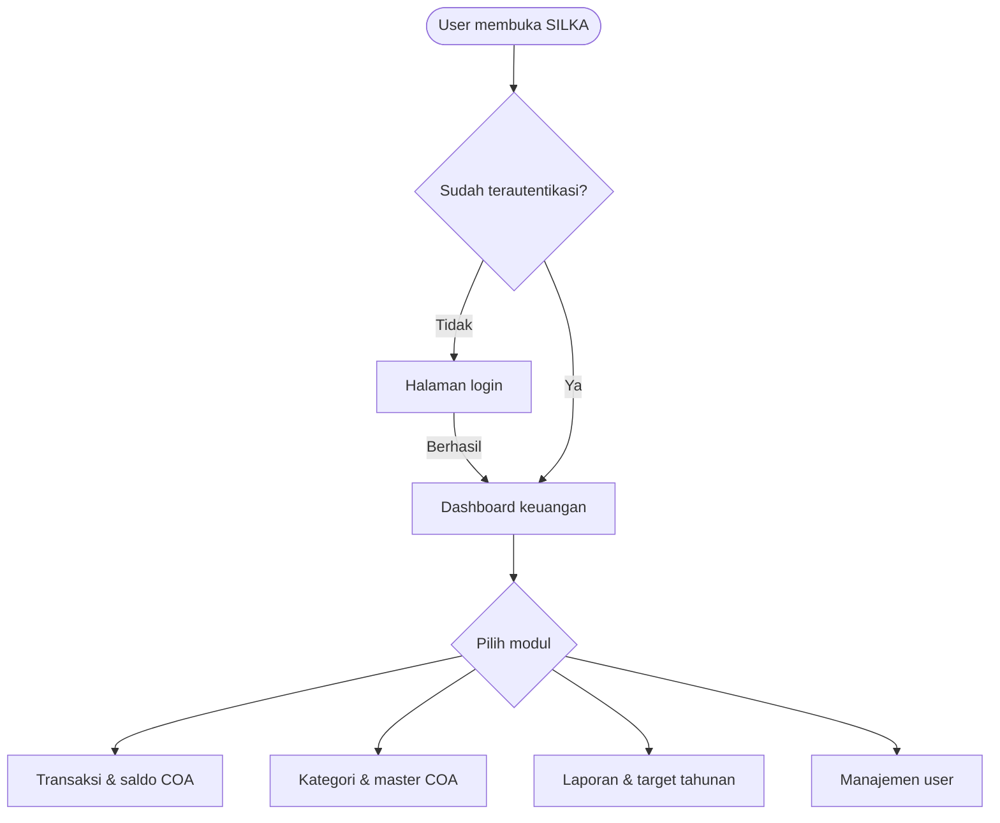
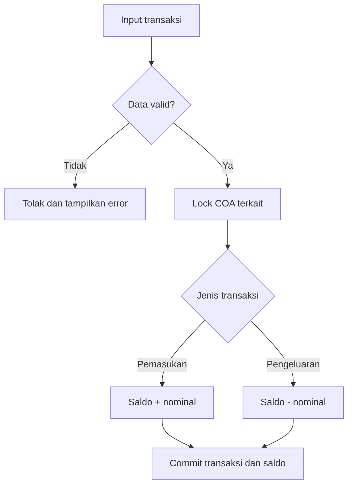
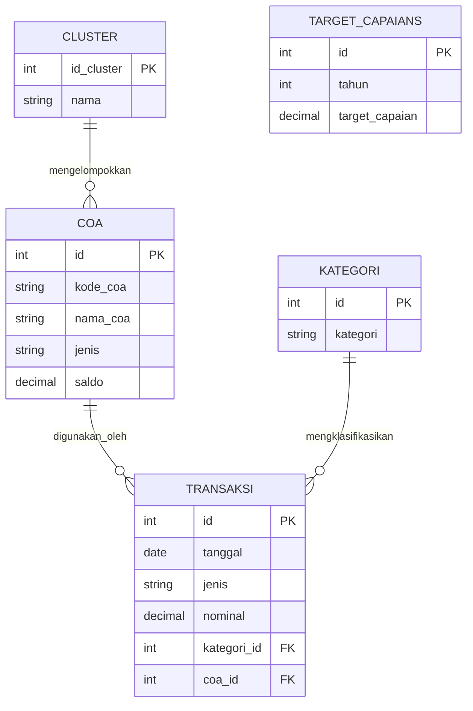
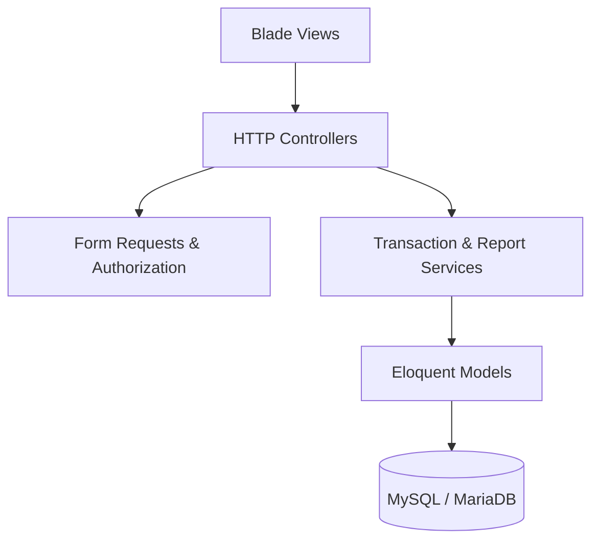
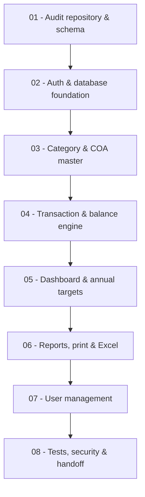

<div align="center">


<br />


<br /><br />

<a href="https://laravel.com">
  
</a>
<a href="https://www.php.net">
  
</a>
<a href="https://www.mysql.com">
  
</a>


<br />


<br /><br />

<strong>Sistem keuangan internal untuk mengelola transaksi, saldo COA, kategori, laporan, target tahunan, dan user dalam satu back office yang terstruktur.</strong>

<br /><br />

<a href="#-tentang-silka">Tentang</a>
&nbsp;&bull;&nbsp;
<a href="#-fitur-utama">Fitur</a>
&nbsp;&bull;&nbsp;
<a href="#-alur-sistem">Alur</a>
&nbsp;&bull;&nbsp;
<a href="#-arsitektur">Arsitektur</a>
&nbsp;&bull;&nbsp;
<a href="#-keamanan--reliability">Keamanan</a>
&nbsp;&bull;&nbsp;
<a href="#-dokumentasi-proyek">Dokumentasi</a>

</div>

---

## 🧭 Tentang SILKA

**SILKA Finance / Back Office** adalah aplikasi web internal yang berdiri secara mandiri untuk membantu pengelolaan aktivitas keuangan operasional. Project ini memusatkan transaksi pemasukan dan pengeluaran, pengelolaan **Chart of Accounts (COA)**, kategori transaksi, laporan, target capaian tahunan, serta akun pengguna.

Aplikasi memiliki autentikasi, konfigurasi, database, dan deployment sendiri. SILKA tidak dibangun sebagai modul internal dari Core System sehingga pengembangannya dapat dilakukan secara terisolasi tanpa mengganggu sistem utama.

> **Engineering principle**  
> Tampilan dapat berubah, tetapi setiap perubahan saldo harus selalu dapat dijelaskan, dihitung ulang, dan dipertanggungjawabkan.

### Repository at a glance

| | Informasi | Detail |
|:--:|---|---|
| 🎯 | Fokus utama | Pengelolaan keuangan dan operasional back office |
| 🧱 | Arsitektur | Standalone web application |
| 🗄️ | Database | MySQL/MariaDB dengan database `silka` |
| 🔐 | Akses | User internal dengan session authentication |
| 💵 | Domain | Pemasukan, pengeluaran, COA, saldo, dan laporan |
| 📊 | Output | Dashboard, web report, print view, dan Excel |
| 🧪 | Prioritas teknis | Konsistensi data, atomic transaction, dan testability |
| 📘 | Acuan implementasi | [`PRD-SILKA.md`](./PRD-SILKA.md) |

---

## ✨ Fitur Utama

<table>
<tr>
<td width="50%" valign="top">
<h3>📊 Financial Dashboard</h3>
<ul>
<li>Ringkasan keuangan berdasarkan tahun.</li>
<li>Total pemasukan dan pengeluaran harian.</li>
<li>Agregasi bulanan dan tahunan.</li>
<li>Target capaian untuk tahun terpilih.</li>
<li>Ringkasan piutang dan hutang berdasarkan klasifikasi COA.</li>
</ul>
</td>
<td width="50%" valign="top">
<h3>💸 Transaction Engine</h3>
<ul>
<li>Pencatatan pemasukan dan pengeluaran.</li>
<li>Pagination 20 data per halaman.</li>
<li>Filter tanggal dan pencarian keterangan.</li>
<li>Penyesuaian saldo COA secara otomatis.</li>
<li>Revert saldo saat transaksi dihapus.</li>
</ul>
</td>
</tr>
<tr>
<td width="50%" valign="top">
<h3>🧾 Chart of Accounts</h3>
<ul>
<li>Pengelolaan master akun COA.</li>
<li>Kode, nama, jenis, cluster, dan saldo akun.</li>
<li>Saldo awal saat akun dibuat.</li>
<li>Filter cluster dan pencarian akun.</li>
<li>Proteksi terhadap penghapusan akun aktif.</li>
</ul>
</td>
<td width="50%" valign="top">
<h3>🏷️ Transaction Categories</h3>
<ul>
<li>Pengelolaan kategori transaksi.</li>
<li>Kategori default sebagai fallback data.</li>
<li>Safety reassignment ketika kategori dihapus.</li>
<li>Perlindungan terhadap orphan transaction.</li>
</ul>
</td>
</tr>
<tr>
<td width="50%" valign="top">
<h3>📑 Financial Reports</h3>
<ul>
<li>Filter berdasarkan kategori dan periode.</li>
<li>Tampilan laporan langsung di web.</li>
<li>Layout khusus untuk kebutuhan print.</li>
<li>Export laporan ke file <code>.xlsx</code>.</li>
<li>Ringkasan pemasukan, pengeluaran, dan nilai bersih.</li>
</ul>
</td>
<td width="50%" valign="top">
<h3>🎯 Annual Targets</h3>
<ul>
<li>Pengelolaan target capaian tahunan.</li>
<li>Satu target unik untuk setiap tahun.</li>
<li>Integrasi langsung dengan dashboard.</li>
<li>Validasi nominal dan tahun target.</li>
</ul>
</td>
</tr>
<tr>
<td width="50%" valign="top">
<h3>👥 User Management</h3>
<ul>
<li>Daftar, tambah, edit, dan hapus user.</li>
<li>Password disimpan menggunakan hash Laravel.</li>
<li>Foto profil maksimal 2 MB.</li>
<li>Penggantian dan pembersihan file foto lama.</li>
<li>Authorization berdasarkan level user existing.</li>
</ul>
</td>
<td width="50%" valign="top">
<h3>🔐 Authentication Layer</h3>
<ul>
<li>Login dan logout berbasis session.</li>
<li>Route internal dilindungi middleware.</li>
<li>Regenerasi session setelah login.</li>
<li>CSRF protection pada setiap mutasi data.</li>
<li>Rate limiting pada percobaan login.</li>
</ul>
</td>
</tr>
</table>

---

## 🧩 Modul Sistem

| Modul | Tanggung jawab | Hasil utama |
|---|---|---|
| **Authentication** | Memvalidasi identitas dan session user | Akses internal yang terlindungi |
| **Dashboard** | Mengagregasi informasi keuangan berdasarkan periode | Ringkasan kondisi keuangan |
| **Transaksi** | Mencatat pemasukan/pengeluaran dan mengubah saldo | Riwayat transaksi yang konsisten |
| **Kategori** | Mengelompokkan transaksi dan menjaga fallback kategori | Data transaksi tetap valid |
| **COA** | Mengelola akun, cluster, jenis, dan saldo | Struktur akun keuangan |
| **Laporan** | Menyaring serta menyajikan data lintas format | Web report, print, dan Excel |
| **Target Capaian** | Menyimpan nominal target setiap tahun | Target tahunan pada dashboard |
| **User** | Mengelola akun, level, password, dan foto | Kontrol pengguna aplikasi |

---

## 🔄 Alur Sistem



<details>
<summary><strong>⚙️ Lihat siklus transaksi dan saldo COA</strong></summary>



</details>

---

## 🧮 Financial Integrity

Inti dari SILKA berada pada konsistensi antara transaksi dan saldo akun. Seluruh operasi finansial harus dijalankan secara atomik menggunakan database transaction dan row locking.

```text
Pemasukan   : saldo_baru = saldo_lama + nominal
Pengeluaran : saldo_baru = saldo_lama - nominal

Edit        : saldo_baru = saldo_sekarang
                           - efek_transaksi_lama
                           + efek_transaksi_baru

Delete      : saldo_baru = saldo_sekarang
                           - efek_transaksi_yang_dihapus
```

### Transaction safety rules

- **Create** menyimpan transaksi dan memperbarui saldo dalam satu commit.
- **Edit** merevert efek lama sebelum menerapkan efek transaksi baru.
- **Delete** mengembalikan pengaruh saldo sebelum menghapus record.
- **Rollback** dijalankan jika salah satu proses gagal.
- **Row lock** melindungi saldo dari perubahan request yang berjalan bersamaan.
- **Decimal value** digunakan untuk menghindari kehilangan presisi nilai uang.

> **Correctness first.** Tidak boleh ada transaksi tanpa akun COA yang valid dan tidak boleh ada perubahan saldo setengah tersimpan.

---

## 🗃️ Data Domain



> Diagram menampilkan model domain yang dibutuhkan aplikasi. Detail tipe primary key, nama foreign key, dan kompatibilitas schema mengikuti database existing serta migration yang sudah diverifikasi.

---

## 🧱 Arsitektur



### Separation of concerns

| Layer | Peran |
|---|---|
| **Views** | Menampilkan data, state, validasi, dan interaksi antarmuka |
| **Controllers** | Mengatur request/response tanpa menampung rumus saldo kompleks |
| **Form Requests** | Menangani validasi dan authorization request |
| **Services** | Menjadi pusat aturan transaksi, saldo, dan laporan |
| **Models** | Mendefinisikan relasi, casts, dan akses data |
| **Database** | Menjaga constraint, index, foreign key, dan atomic transaction |

### Technology stack

| Area | Teknologi |
|---|---|
| Backend framework | Laravel 8.x |
| Runtime | PHP 7.4.x |
| Database | MySQL/MariaDB |
| ORM | Laravel Eloquent |
| Interface | Blade server-rendered views |
| Authentication | Laravel session authentication |
| Validation | Form Request / Laravel Validator |
| File storage | Laravel Filesystem |
| Reporting | Web view, print view, dan Excel `.xlsx` |
| Testing | Laravel/PHP automated tests |

---

## 🛡️ Keamanan & Reliability

<div align="center">


</div>

- Seluruh route internal dilindungi authentication middleware.
- Authorization dilakukan di backend, bukan hanya dengan menyembunyikan menu.
- Password tidak pernah disimpan atau dibandingkan dalam bentuk plain text.
- Seluruh request mutasi dilindungi CSRF.
- Login menggunakan session regeneration dan rate limiting.
- File foto divalidasi berdasarkan ukuran dan tipe file sebenarnya.
- Nama file upload dibuat ulang untuk menghindari path dan filename abuse.
- Query menggunakan Eloquent/query binding untuk menghindari SQL injection.
- Export Excel melindungi input user dari formula injection.
- Migration tidak boleh menjalankan penghapusan data secara otomatis.
- Error production tidak membocorkan stack trace, token, atau kredensial.

---

## 🧪 Quality Standard

Project ini dirancang dengan pengujian yang berfokus pada aturan bisnis, bukan hanya keberhasilan halaman dimuat.

```text
AUTHENTICATION  → guest protection, login, logout, authorization
TRANSACTION     → create, edit, delete, rollback, saldo adjustment
MASTER DATA     → category fallback, COA constraints, unique values
DASHBOARD       → period selection, aggregation, empty state
REPORTING       → filter consistency, totals, print, valid Excel output
USER            → password hashing, upload validation, access control
```

### Definition of quality

- Perhitungan saldo memiliki automated tests.
- Web, print, dan Excel menggunakan sumber query yang konsisten.
- Tidak ada orphan category atau COA reference.
- Tidak ada secret, debug dump, atau konfigurasi sensitif di repository.
- List utama menggunakan pagination dan menghindari N+1 query.
- Interface tetap terbaca pada desktop, tablet, dan mobile.
- Blocker schema atau aturan bisnis tidak diselesaikan dengan data tebakan.

---

## 🗺️ Development Blueprint



Setiap tahap memiliki acceptance criteria dan quality gate sendiri. Detail eksekusi, asumsi, schema gap, serta test plan tersedia pada dokumen PRD.

---

## 📘 Dokumentasi Proyek

| Dokumen | Keterangan |
|---|---|
| [`README.md`](./README.md) | Gambaran umum dan identitas repository |
| [`PRD-SILKA.md`](./PRD-SILKA.md) | Product requirement, aturan bisnis, arsitektur, fase implementasi, dan acceptance criteria |
| `IMPLEMENTATION_LOG.md` | Catatan audit, progress fase, keputusan teknis, hasil test, dan blocker implementasi |

### Catatan implementasi penting

Beberapa bagian wajib diverifikasi dari source code atau schema existing sebelum implementasi:

- keberadaan relasi `transaksi.coa_id`;
- keberadaan kolom saldo pada tabel `coa`;
- arti nilai yang digunakan pada `users.level`;
- klasifikasi COA untuk piutang dan hutang;
- pola cluster yang digunakan ketika COA dibuat.

Nilai tersebut tidak boleh ditebak karena berpengaruh langsung pada authorization dan akurasi data finansial.

---

## 💡 Project Philosophy

<div align="center">

### `Readable code. Predictable flow. Explainable balance.`

SILKA dibangun dengan prinsip bahwa software keuangan harus mudah dipahami oleh user, dapat dipelihara oleh developer, dan tetap konsisten saat menghadapi kegagalan maupun request yang berjalan bersamaan.

<br />


</div>

<br />

<div align="center">

<sub>Financial Operations • Transactional Integrity • Clean Architecture</sub>

<br /><br />


</div>
